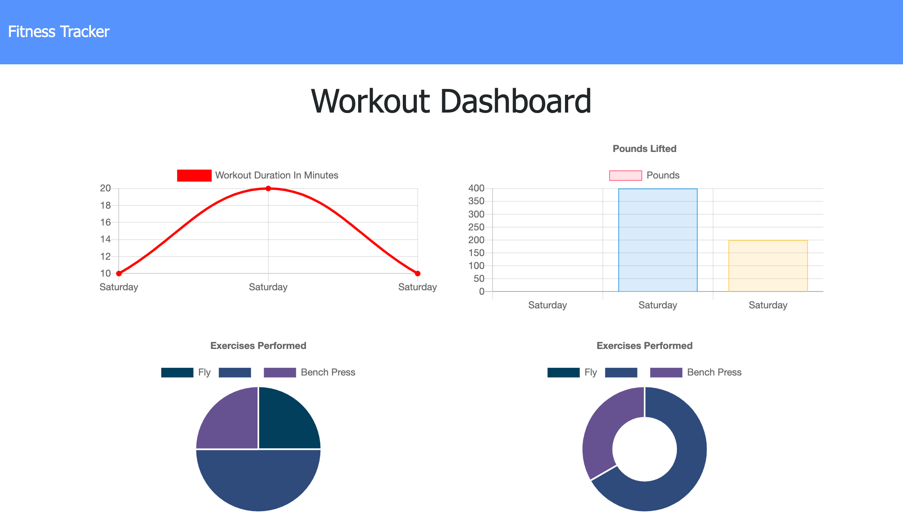

# Workout-Tracker

-------------------------------------------------- Personal Notes -------------------------------------------------

Deployed Heroku App Link: https://eddiephi-workout-tracker.herokuapp.com/

Description:
I developed the backend for a Workout Tracker application. Users can add new exercises and track their progress. A progress dashboard provides charts for better visualization of progress.

Screenshot:

Technologies: JavaScript, Node, NPM, Express, mongoDB

License: MIT

I used https://validator.w3.org/nu/ to validate my work.

---------------------------------------------------- Contact ----------------------------------------------------

Email: ephimansone@gmail.com 

LinkedIn: https://linkedin.com/in/eddiephi

GitHub: https://github.com/EddiePhi

Portfolio: https://eddiephi.github.io/EddiePhiPortfolio/